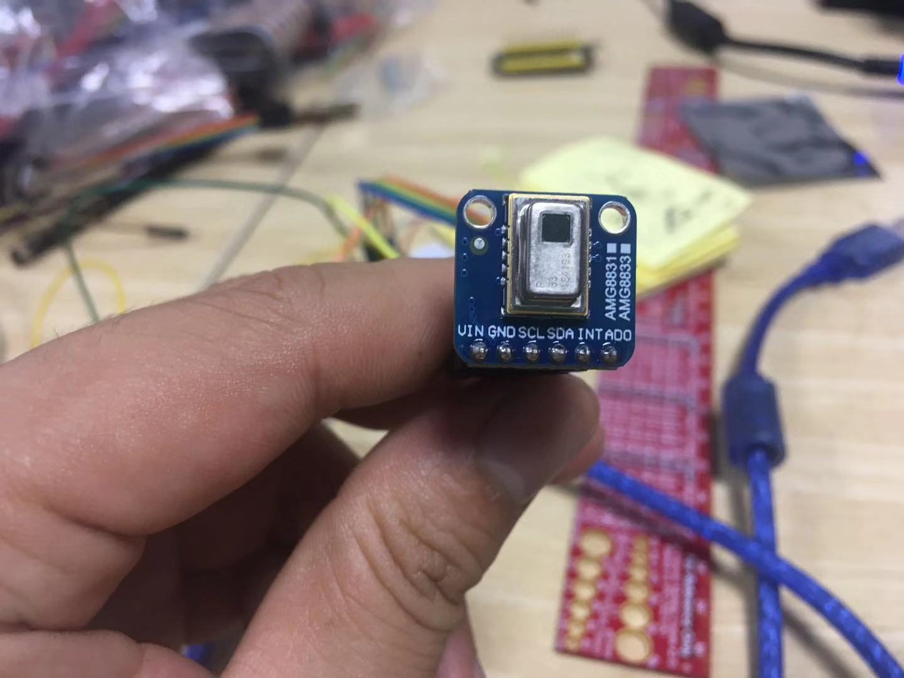

# Wires

## About this file

> This file is used to record the connect between Arduino Uno and AMG8833 Kit.

## About AMG8833 Kit

> Please to find the schmatic file in the same folder(./test/schematics_eval_kit.pdf)
> The real board is a little different with schmatic. It have a LDO to change 5V to 3.3V. And using 3.3V as power supply. The real board also use a professional chip to handle as a bridge between 3.3V I2C and 5.0V I2C. Find image from 
> It should be ok for AMG8853. But I can not test it.

## Connect

|Arduino Uno| AMG8833 Kit|Notes|
|:-----|:-----|:-----|
|5V|VIN|Power Source: 5.0v
|GND|GND|Power Source: GND
|SCL@IOH Header|SCL|I2C-SCL
|SDA@IOH Header|SDA|I2C-SDA
|NC|AD0/AD_SEL| Push up to VCC
|NC|INT|Didn't use it|